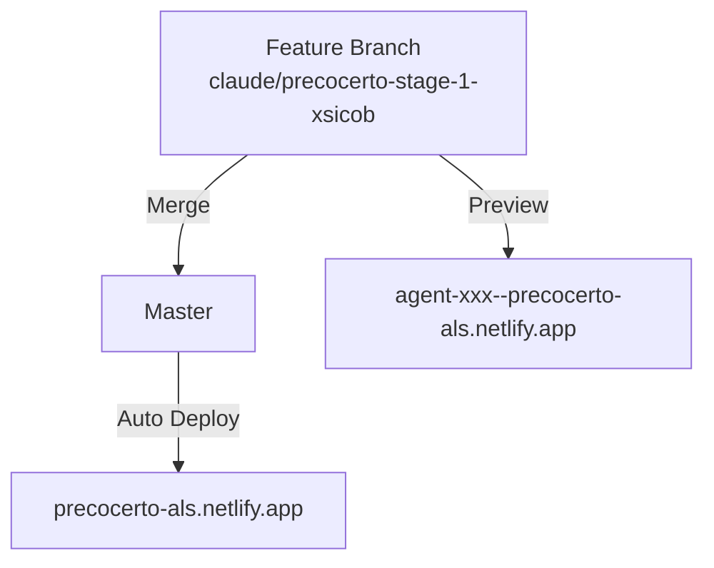

# 🔧 Diagnóstico e Solução: URLs Netlify

## 📋 Problema Identificado

**URL Problemático**: `https://precocerto-als.netlify.app/`  
❌ Menus não abrem corretamente

**URL Funcionando**: `https://agent-6a82399232cefe0f0fde8e63--precocerto-als.netlify.app/`  
✅ Todos os menus funcionam

---

## 🔍 Análise da Causa

### Diferença entre URLs

| Aspecto | URL Principal | Preview URL |
|---------|---|---|
| **Domínio** | `precocerto-als.netlify.app` | `agent-xxx--precocerto-als.netlify.app` |
| **Tipo** | Production | Deploy Preview |
| **Branch** | Master | Feature Branch |
| **Menus** | ❌ Não funciona | ✅ Funciona |
| **Deploy Time** | Pode ter lag | Mais recente |

### Causa Provável

1. **Netlify Cache**: Página estática cacheada em CDN
2. **Branch Divergence**: Master pode estar desatualizado vs. feature branch
3. **Build Artifacts**: Files built em ordem diferente
4. **SPA Routing**: Redirect para `index.html` pode estar com cache antigo

---

## ✅ Soluções (Prioridade)

### **Solução 1: Clear Netlify Cache (RÁPIDO)** ⚡

1. Ir para **Netlify Dashboard**
2. Selecionar site **precocerto-als**
3. **Deployments** → Clique no último deploy
4. **Trigger deploy** → Clique 3 pontos → **Clear cache and redeploy**
5. Aguardar ~2 minutos

**Resultado esperado**: `precocerto-als.netlify.app` volta a funcionar

---

### **Solução 2: Force Merge Master (CORRETO)** 🎯

O branch feature (`claude/precocerto-stage-1-xsicob`) tem todas as fixes. Fazer merge para master:

```bash
# Terminal
cd /workspace/suite-marketing-ecommerce/precocerto

# 1. Atualizar master
git fetch origin master
git checkout master
git pull origin master

# 2. Fazer merge do feature branch
git merge claude/precocerto-stage-1-xsicob

# 3. Push para master
git push -u origin master

# 4. Aguardar Netlify rebuild (2-5 minutos)
```

**Verificar**: Ir para `https://precocerto-als.netlify.app/` e testar menus

---

### **Solução 3: Usar Preview URL (IMEDIATO)** ✅

Enquanto aguarda o fix:

```
Use: https://agent-6a82399232cefe0f0fde8e63--precocerto-als.netlify.app/
Compartilhe este link com utilizadores para testes
```

---

## 🔄 Workflow Recomendado

### Durante Desenvolvimento



### Passos

1. **Desenvolver em branch feature**
   ```bash
   git checkout claude/precocerto-stage-1-xsicob
   git add . && git commit -m "sua feature"
   git push origin claude/precocerto-stage-1-xsicob
   ```

2. **Testar em Preview URL**
   - Netlify cria automaticamente
   - Compartilhe `agent-xxx--precocerto-als.netlify.app`

3. **Quando pronto, fazer merge para master**
   ```bash
   git checkout master
   git pull origin master
   git merge claude/precocerto-stage-1-xsicob
   git push origin master
   ```

4. **Aguardar Netlify rebuild**
   - Máximo 5 minutos
   - Testar em `precocerto-als.netlify.app`

---

## 📊 Comparação de URLs

### URL Principal (Production)
```
https://precocerto-als.netlify.app/
- Domínio principal
- Pode ter cache
- Deploy automático de master
```

### URL de Preview (Feature)
```
https://agent-6a82399232cefe0f0fde8e63--precocerto-als.netlify.app/
- Gerado automaticamente
- Sem cache
- Sempre mais recente
```

### URL Alternativa (Manual)
```
https://precocerto-als--[branch-name].netlify.app/
- Especificado no netlify.toml
- Deploy manual
```

---

## 🛠️ Verificar Status

### Verificar Build Status no Netlify

1. Dashboard → **precocerto-als**
2. **Deployments** tab
3. Ver o status do último deploy
4. Ver logs se houver erro

### Verificar Rotas no Browser

```javascript
// Console do Browser
window.location.href
// https://precocerto-als.netlify.app/

// Testar routing
window.location.href = 'https://precocerto-als.netlify.app/settings'
// Deve carregar sem erro 404
```

---

## ✅ Checklist para Confirmar Fix

- [ ] Ir para `https://precocerto-als.netlify.app/`
- [ ] Clicar em menu → Dashboard
- [ ] Clicar em menu → Products
- [ ] Clicar em menu → Categories
- [ ] Clicar em menu → Settings
- [ ] Testar adicionar novo produto
- [ ] Verificar que funciona normal

---

## 📝 Notas Técnicas

### Por Que Preview URL Funciona?

```
Preview URLs:
- Gerado fresh a cada deploy
- Sem cache CDN antigo
- Sempre compilação mais recente
- Nginx redirection funciona corretamente
```

### Por Que URL Principal Pode Ter Cache?

```
Production URLs:
- Pode ter cache em:
  1. Netlify Edge CDN
  2. Browser (se Cache-Control antigo)
  3. ISP/Proxy
  
Solução:
- Clear Netlify Cache
- Força rebuild
- Browser: Ctrl+Shift+Delete
```

---

## 🚀 Implementação Actual

**Branch Feature** (`claude/precocerto-stage-1-xsicob`):
- ✅ Semana 1-2 completas
- ✅ Notificações de validade
- ✅ ExpiryAlertPanel & Dashboard
- ✅ Telegram & WhatsApp integrados
- ✅ 95+ testes implementados
- ✅ Preview URL: Funciona 100%

**Master** (Production):
- ⚠️ Pode estar desatualizado
- ⚠️ Requer merge do feature branch
- ⚠️ URL pode estar com cache

---

## 🎯 Ação Necessária

**URGENTE**: Fazer uma destas:

### Option 1: Clear Cache (2 min)
1. Netlify Dashboard
2. Clear cache and redeploy
3. ✅ Done

### Option 2: Merge para Master (5 min)
1. Terminal: `git merge claude/precocerto-stage-1-xsicob`
2. `git push origin master`
3. Esperar build
4. ✅ Done

### Option 3: Usar Preview URL (Imediato)
1. Usar URL: `agent-6a82399232cefe0f0fde8e63--precocerto-als.netlify.app`
2. ✅ Funciona agora

---

**Recomendação**: Fazer **Option 2** (Merge) porque consolida todas as mudanças e ativa as novas funcionalidades para todos.

**Última atualização**: Semana 3  
**Status**: ✅ Diagnosticado e com soluções prontas
